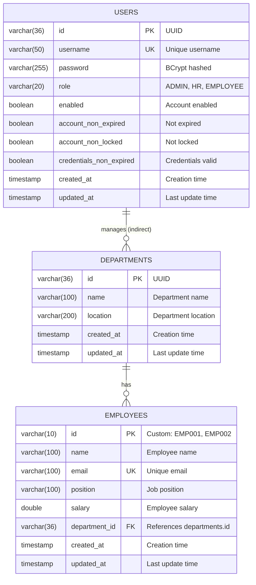
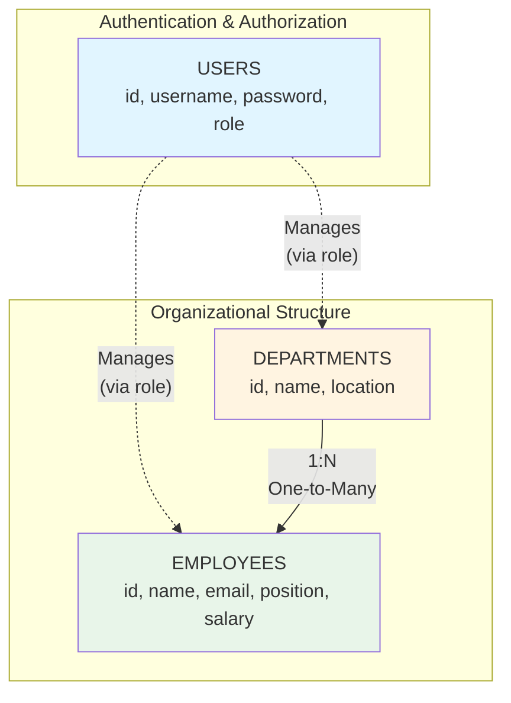
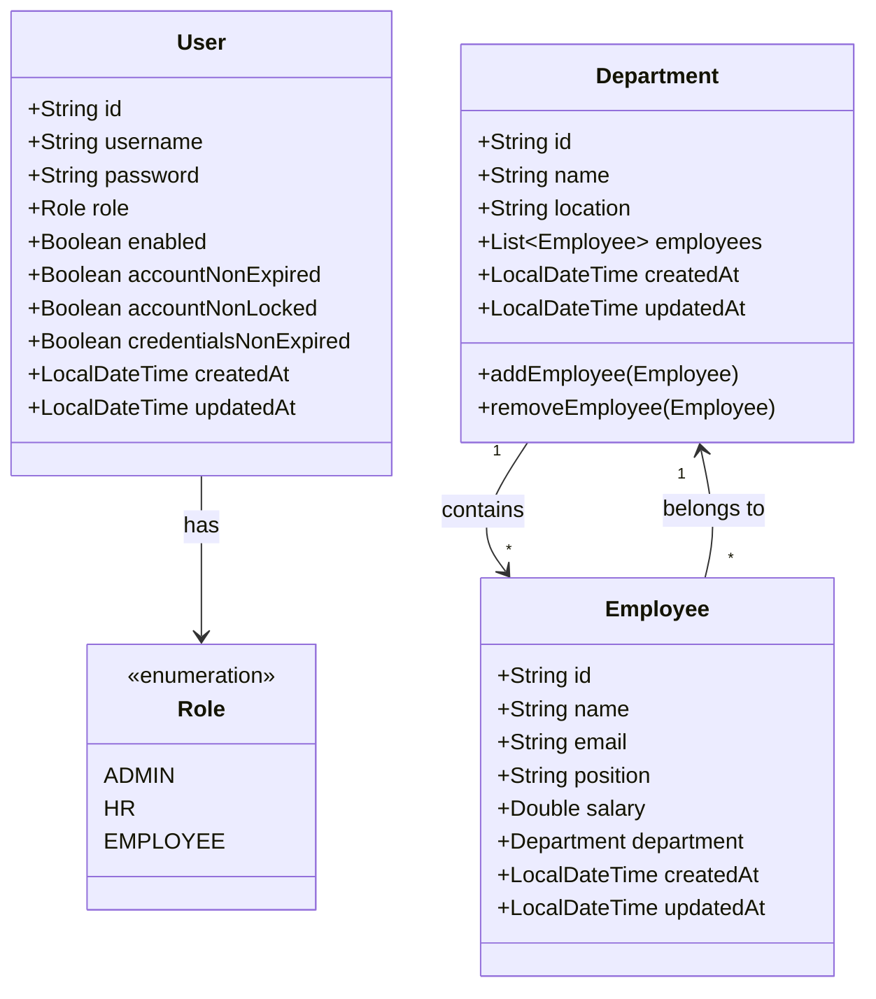

# Department Management System - Entity-Relationship Diagram

## Table of Contents
1. [ER Diagram Visualization](#er-diagram-visualization)
2. [Entity Descriptions](#entity-descriptions)
3. [Relationships](#relationships)
4. [Constraints and Indexes](#constraints-and-indexes)
5. [Business Rules](#business-rules)

---

## ER Diagram Visualization

### Complete ER Diagram



### Simplified Relationship Diagram



### Database Schema Diagram



---

## Entity Descriptions

### 1. USERS Entity

**Purpose**: Manages user authentication and role-based access control.

**Table Name**: `users`

**Attributes**:

| Attribute | Data Type | Constraints | Description |
|-----------|-----------|-------------|-------------|
| **id** | VARCHAR(36) | PRIMARY KEY | Unique identifier (UUID format) |
| **username** | VARCHAR(50) | UNIQUE, NOT NULL | Login username |
| **password** | VARCHAR(255) | NOT NULL | BCrypt hashed password (60 chars) |
| **role** | VARCHAR(20) | NOT NULL | User role: ADMIN, HR, or EMPLOYEE |
| **enabled** | BOOLEAN | NOT NULL, DEFAULT TRUE | Account activation status |
| **account_non_expired** | BOOLEAN | NOT NULL, DEFAULT TRUE | Account expiration flag |
| **account_non_locked** | BOOLEAN | NOT NULL, DEFAULT TRUE | Account lock status |
| **credentials_non_expired** | BOOLEAN | NOT NULL, DEFAULT TRUE | Password expiration flag |
| **created_at** | TIMESTAMP | NOT NULL | Record creation timestamp |
| **updated_at** | TIMESTAMP | | Last modification timestamp |

**Roles**:
- **ADMIN**: Full system access, can create users, delete any record
- **HR**: Can create/update departments and employees, view salary data
- **EMPLOYEE**: Read-only access to departments and employees

**Sample Data**:
```sql
INSERT INTO users (id, username, password, role, enabled, account_non_expired, 
                   account_non_locked, credentials_non_expired, created_at)
VALUES 
  ('550e8400-e29b-41d4-a716-446655440000', 'admin', 
   '$2a$10$...', 'ADMIN', true, true, true, true, NOW()),
  ('660e8400-e29b-41d4-a716-446655440001', 'hr', 
   '$2a$10$...', 'HR', true, true, true, true, NOW()),
  ('770e8400-e29b-41d4-a716-446655440002', 'employee', 
   '$2a$10$...', 'EMPLOYEE', true, true, true, true, NOW());
```

---

### 2. DEPARTMENTS Entity

**Purpose**: Represents organizational departments within the company.

**Table Name**: `departments`

**Attributes**:

| Attribute | Data Type | Constraints | Description |
|-----------|-----------|-------------|-------------|
| **id** | VARCHAR(36) | PRIMARY KEY | Unique identifier (UUID format) |
| **name** | VARCHAR(100) | NOT NULL | Department name (e.g., "IT", "HR") |
| **location** | VARCHAR(200) | NOT NULL | Physical location of department |
| **created_at** | TIMESTAMP | NOT NULL | Record creation timestamp |
| **updated_at** | TIMESTAMP | | Last modification timestamp |

**Relationships**:
- One-to-Many with EMPLOYEES (one department has many employees)

**Sample Data**:
```sql
INSERT INTO departments (id, name, location, created_at)
VALUES 
  ('d1-550e8400-e29b-41d4-a716-446655440000', 'IT', 
   'Building A, Floor 3', NOW()),
  ('d2-660e8400-e29b-41d4-a716-446655440001', 'HR', 
   'Building B, Floor 1', NOW()),
  ('d3-770e8400-e29b-41d4-a716-446655440002', 'Finance', 
   'Building A, Floor 2', NOW());
```

---

### 3. EMPLOYEES Entity

**Purpose**: Stores employee information and links employees to departments.

**Table Name**: `employees`

**Attributes**:

| Attribute | Data Type | Constraints | Description |
|-----------|-----------|-------------|-------------|
| **id** | VARCHAR(10) | PRIMARY KEY | Custom business key (EMP001, EMP002, etc.) |
| **name** | VARCHAR(100) | NOT NULL | Full name of employee |
| **email** | VARCHAR(100) | UNIQUE, NOT NULL | Employee email address |
| **position** | VARCHAR(100) | NOT NULL | Job title/position |
| **salary** | DOUBLE | NOT NULL | Annual salary |
| **department_id** | VARCHAR(36) | FOREIGN KEY, NOT NULL | References departments(id) |
| **created_at** | TIMESTAMP | NOT NULL | Record creation timestamp |
| **updated_at** | TIMESTAMP | | Last modification timestamp |

**Relationships**:
- Many-to-One with DEPARTMENTS (many employees belong to one department)

**Custom ID Generation**:
- Format: `EMP` + zero-padded sequential number
- Examples: `EMP001`, `EMP002`, `EMP010`, `EMP100`
- Generated automatically by `EmployeeIdGenerator` utility class
- Ensures unique, human-readable identifiers

**Sample Data**:
```sql
INSERT INTO employees (id, name, email, position, salary, department_id, created_at)
VALUES 
  ('EMP001', 'John Doe', 'john.doe@company.com', 
   'Software Engineer', 75000.00, 'd1-550e8400-e29b-41d4-a716-446655440000', NOW()),
  ('EMP002', 'Jane Smith', 'jane.smith@company.com', 
   'Senior Developer', 95000.00, 'd1-550e8400-e29b-41d4-a716-446655440000', NOW()),
  ('EMP003', 'Bob Johnson', 'bob.johnson@company.com', 
   'HR Manager', 80000.00, 'd2-660e8400-e29b-41d4-a716-446655440001', NOW());
```

---

## Relationships

### 1. Department ↔ Employee (One-to-Many)

**Relationship Type**: One-to-Many

**Description**: 
- One department can have multiple employees
- Each employee belongs to exactly one department

**Cardinality**:
- Department side: `1` (mandatory)
- Employee side: `0..*` (zero or more)

**Foreign Key**: `employees.department_id` → `departments.id`

**JPA Mapping**:

**Department Entity**:
```java
@OneToMany(mappedBy = "department", cascade = CascadeType.ALL, orphanRemoval = true)
private List<Employee> employees = new ArrayList<>();
```

**Employee Entity**:
```java
@ManyToOne(fetch = FetchType.LAZY)
@JoinColumn(name = "department_id", nullable = false)
private Department department;
```

**Cascade Operations**:
- **CascadeType.ALL**: All operations (persist, merge, remove, refresh, detach) cascade from department to employees
- **orphanRemoval = true**: When an employee is removed from department's employee list, it's deleted from database

**Fetch Strategy**:
- **LAZY**: Department is loaded only when explicitly accessed (performance optimization)

**Bidirectional Relationship**:
- Department maintains a list of employees
- Employee maintains a reference to its department
- Helper methods in Department entity maintain consistency:
  ```java
  public void addEmployee(Employee employee) {
      employees.add(employee);
      employee.setDepartment(this);
  }
  
  public void removeEmployee(Employee employee) {
      employees.remove(employee);
      employee.setDepartment(null);
  }
  ```

### 2. User ↔ Department/Employee (Indirect)

**Relationship Type**: Indirect (via role-based permissions)

**Description**:
- Users don't have direct foreign key relationships with departments or employees
- Relationship is managed through role-based access control (RBAC)
- User's role determines what operations they can perform on departments and employees

**Access Control**:
- **ADMIN**: Can create, read, update, delete departments and employees
- **HR**: Can create, read, update departments and employees (cannot delete)
- **EMPLOYEE**: Can only read departments and employees

---

## Constraints and Indexes

### Primary Keys

| Table | Column | Type | Description |
|-------|--------|------|-------------|
| users | id | VARCHAR(36) | UUID generated by database |
| departments | id | VARCHAR(36) | UUID generated by database |
| employees | id | VARCHAR(10) | Custom business key (EMP001, etc.) |

### Unique Constraints

| Table | Column(s) | Purpose |
|-------|-----------|---------|
| users | username | Prevent duplicate usernames |
| employees | email | Prevent duplicate email addresses |

**SQL Definition**:
```sql
-- Users table
ALTER TABLE users ADD CONSTRAINT uk_users_username UNIQUE (username);

-- Employees table
ALTER TABLE employees ADD CONSTRAINT uk_employees_email UNIQUE (email);
```

### Foreign Key Constraints

| Child Table | Column | Parent Table | Parent Column | On Delete |
|-------------|--------|--------------|---------------|-----------|
| employees | department_id | departments | id | CASCADE |

**SQL Definition**:
```sql
ALTER TABLE employees 
ADD CONSTRAINT fk_employees_department 
FOREIGN KEY (department_id) 
REFERENCES departments(id) 
ON DELETE CASCADE;
```

**Cascade Behavior**:
- When a department is deleted, all associated employees are automatically deleted
- Ensures referential integrity
- Prevents orphaned employee records

### Not Null Constraints

**users table**:
- id, username, password, role, enabled, account_non_expired, account_non_locked, credentials_non_expired, created_at

**departments table**:
- id, name, location, created_at

**employees table**:
- id, name, email, position, salary, department_id, created_at

### Check Constraints (Optional)

While not explicitly defined in the current schema, these could be added for additional validation:

```sql
-- Ensure salary is positive
ALTER TABLE employees 
ADD CONSTRAINT chk_employees_salary_positive 
CHECK (salary > 0);

-- Ensure role is valid
ALTER TABLE users 
ADD CONSTRAINT chk_users_role_valid 
CHECK (role IN ('ADMIN', 'HR', 'EMPLOYEE'));
```

### Indexes

**Automatically Created**:
- Primary key indexes on all `id` columns
- Unique indexes on `users.username` and `employees.email`
- Foreign key index on `employees.department_id`

**Recommended Additional Indexes** (for performance):
```sql
-- Index for filtering employees by department
CREATE INDEX idx_employees_department_id ON employees(department_id);

-- Index for searching employees by name
CREATE INDEX idx_employees_name ON employees(name);

-- Index for searching departments by name
CREATE INDEX idx_departments_name ON departments(name);
```

---

## Business Rules

### 1. Employee ID Generation

**Rule**: Employee IDs are automatically generated in sequential format `EMP001`, `EMP002`, etc.

**Implementation**:
- `EmployeeIdGenerator` utility class
- Queries database for highest existing employee ID
- Increments and formats with zero-padding
- Ensures uniqueness and readability

**Code Logic**:
```java
public static String generateNextEmployeeId(EmployeeRepository repository) {
    String lastId = repository.findTopByOrderByIdDesc()
        .map(Employee::getId)
        .orElse("EMP000");
    
    int nextNumber = Integer.parseInt(lastId.substring(3)) + 1;
    return String.format("EMP%03d", nextNumber);
}
```

### 2. Email Uniqueness

**Rule**: Each employee must have a unique email address across the entire system.

**Enforcement**:
- Database unique constraint on `employees.email`
- Application-level validation in service layer
- Custom exception `DuplicateEmailException` thrown on violation

**Validation**:
```java
if (employeeRepository.existsByEmail(email)) {
    throw new DuplicateEmailException("Email already exists: " + email);
}
```

### 3. Department-Employee Relationship

**Rule**: An employee must always belong to exactly one department.

**Enforcement**:
- `department_id` is NOT NULL in database
- Foreign key constraint ensures department exists
- Cascade delete ensures no orphaned employees

**Business Logic**:
- When creating an employee, department must be specified
- When deleting a department, all employees are also deleted
- When updating an employee, department can be changed (transfer)

### 4. User Role Hierarchy

**Rule**: Different user roles have different permissions.

**Hierarchy**:
```
ADMIN (highest privileges)
  ↓
HR (moderate privileges)
  ↓
EMPLOYEE (read-only)
```

**Enforcement**:
- Spring Security `@PreAuthorize` annotations
- JWT token contains role claim
- Backend validates role on every protected endpoint

### 5. Password Security

**Rule**: Passwords must be securely hashed before storage.

**Implementation**:
- BCrypt hashing algorithm with strength 10
- Automatic salting (unique per password)
- One-way hashing (cannot be reversed)
- Validation via BCrypt compare function

**Code**:
```java
String hashedPassword = passwordEncoder.encode(plainPassword);
boolean matches = passwordEncoder.matches(plainPassword, hashedPassword);
```

### 6. Audit Trail

**Rule**: All entities must track creation and modification timestamps.

**Implementation**:
- `@CreatedDate` annotation on `created_at` field
- `@LastModifiedDate` annotation on `updated_at` field
- `@EntityListeners(AuditingEntityListener.class)` on entity classes
- Automatic population by Spring Data JPA

**Benefits**:
- Track when records were created
- Track when records were last modified
- Useful for debugging and auditing
- No manual timestamp management required

### 7. Cascade Delete Protection

**Rule**: Deleting a department deletes all associated employees.

**Rationale**:
- Prevents orphaned employee records
- Maintains referential integrity
- Simplifies data management

**Warning**:
- This is a destructive operation
- Only ADMIN role can delete departments
- Consider soft delete for production systems

**Alternative Approach** (Soft Delete):
```java
@Entity
public class Department {
    private Boolean deleted = false;
    private LocalDateTime deletedAt;
}
```

### 8. Data Validation

**Rule**: All input data must be validated before persistence.

**Validation Rules**:

**Department**:
- Name: Required, max 100 characters
- Location: Required, max 200 characters

**Employee**:
- Name: Required, max 100 characters
- Email: Required, valid email format, unique, max 100 characters
- Position: Required, max 100 characters
- Salary: Required, must be positive number
- Department: Required, must exist in database

**User**:
- Username: Required, unique, 3-50 characters
- Password: Required, minimum 6 characters
- Role: Required, must be ADMIN, HR, or EMPLOYEE

**Implementation**:
- Jakarta Bean Validation (`@Valid`, `@NotNull`, `@Email`, etc.)
- Service layer validation
- Global exception handler for validation errors

---

## Database Migration Strategy

### Development Environment

**Strategy**: `ddl-auto: create-drop`

- Database schema is recreated on every application restart
- Sample data is seeded via `DataInitializer`
- Suitable for development and testing
- **Warning**: All data is lost on restart

### Production Environment

**Strategy**: `ddl-auto: validate`

- Hibernate validates schema against entities
- No automatic schema changes
- Use migration tools for schema updates

**Recommended Tools**:
- **Flyway**: Version-controlled database migrations
- **Liquibase**: Database-independent migrations

**Example Flyway Migration** (`V1__initial_schema.sql`):
```sql
CREATE TABLE users (
    id VARCHAR(36) PRIMARY KEY,
    username VARCHAR(50) UNIQUE NOT NULL,
    password VARCHAR(255) NOT NULL,
    role VARCHAR(20) NOT NULL,
    enabled BOOLEAN NOT NULL DEFAULT TRUE,
    account_non_expired BOOLEAN NOT NULL DEFAULT TRUE,
    account_non_locked BOOLEAN NOT NULL DEFAULT TRUE,
    credentials_non_expired BOOLEAN NOT NULL DEFAULT TRUE,
    created_at TIMESTAMP NOT NULL,
    updated_at TIMESTAMP
);

CREATE TABLE departments (
    id VARCHAR(36) PRIMARY KEY,
    name VARCHAR(100) NOT NULL,
    location VARCHAR(200) NOT NULL,
    created_at TIMESTAMP NOT NULL,
    updated_at TIMESTAMP
);

CREATE TABLE employees (
    id VARCHAR(10) PRIMARY KEY,
    name VARCHAR(100) NOT NULL,
    email VARCHAR(100) UNIQUE NOT NULL,
    position VARCHAR(100) NOT NULL,
    salary DOUBLE PRECISION NOT NULL,
    department_id VARCHAR(36) NOT NULL,
    created_at TIMESTAMP NOT NULL,
    updated_at TIMESTAMP,
    CONSTRAINT fk_employees_department 
        FOREIGN KEY (department_id) 
        REFERENCES departments(id) 
        ON DELETE CASCADE
);

CREATE INDEX idx_employees_department_id ON employees(department_id);
```

---

## Summary

### Entity Count: 3

1. **USERS**: Authentication and authorization
2. **DEPARTMENTS**: Organizational structure
3. **EMPLOYEES**: Employee records

### Relationship Count: 1 Direct

1. **DEPARTMENTS ↔ EMPLOYEES**: One-to-Many (with cascade delete)

### Key Features

✅ **UUID Primary Keys**: For users and departments (database-generated)  
✅ **Custom Business Keys**: For employees (application-generated)  
✅ **Referential Integrity**: Foreign key constraints with cascade delete  
✅ **Data Uniqueness**: Unique constraints on username and email  
✅ **Audit Trail**: Automatic timestamp tracking  
✅ **Role-Based Access**: Three-tier permission system  
✅ **Password Security**: BCrypt hashing  
✅ **Cascade Operations**: Automatic employee deletion with department  

---

**Last Updated**: February 12, 2026  
**Version**: 1.0.0  
**Database**: H2 (Development), PostgreSQL/MySQL (Production)
