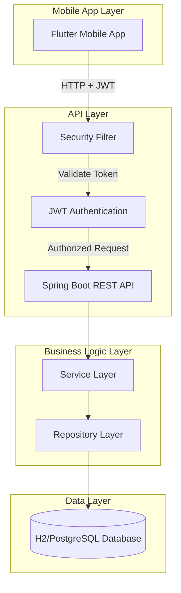
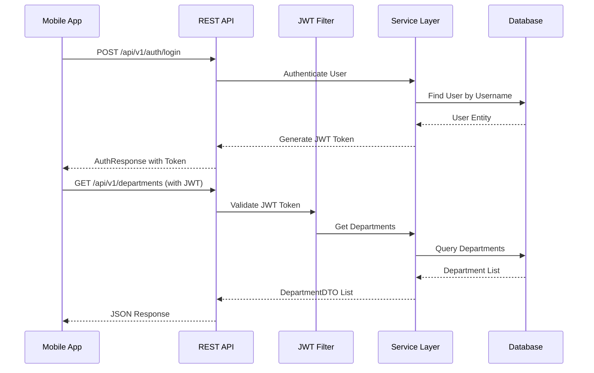
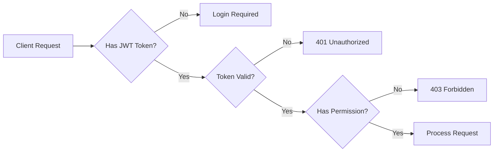
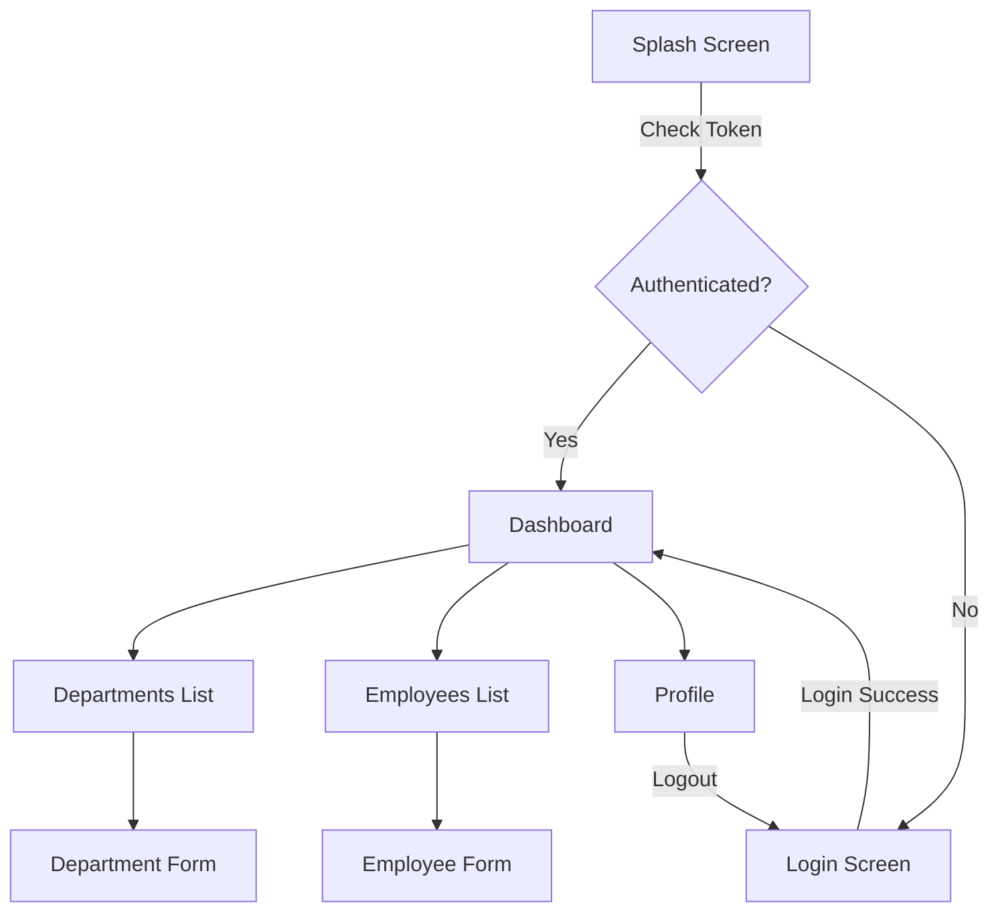
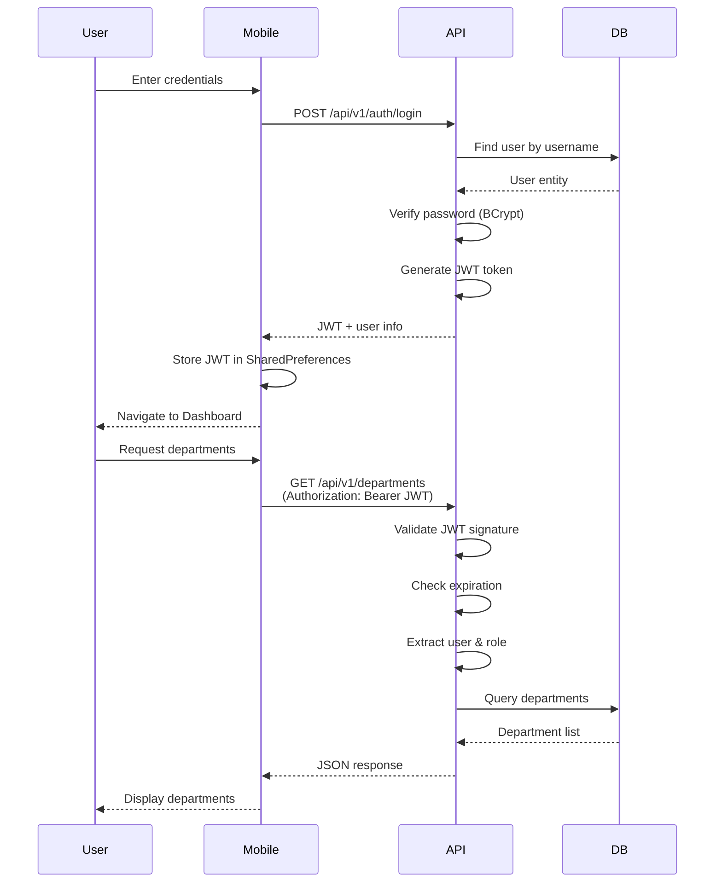

# Department Management System - Complete Project Guide

## Table of Contents
1. [Project Overview](#project-overview)
2. [Technology Stack](#technology-stack)
3. [System Architecture](#system-architecture)
4. [Backend API Documentation](#backend-api-documentation)
5. [Mobile Application Documentation](#mobile-application-documentation)
6. [Database Schema](#database-schema)
7. [Setup and Installation](#setup-and-installation)
8. [API Reference](#api-reference)
9. [Security Features](#security-features)
10. [Testing](#testing)
11. [Deployment](#deployment)

---

## Project Overview

The **Department Management System** is a full-stack enterprise application designed to manage departments and employees within an organization. It provides a robust backend API built with Spring Boot and a cross-platform mobile application built with Flutter.

### Key Features

#### Backend Features
- **Role-Based Access Control (RBAC)**: Three user roles - ADMIN, HR, and EMPLOYEE
- **JWT Authentication**: Secure token-based authentication with stateless sessions
- **RESTful API**: Versioned API endpoints (`/api/v1`)
- **PDF Report Generation**: JasperReports integration for department reports
- **Custom Employee IDs**: Auto-generated sequential IDs (EMP001, EMP002, etc.)
- **Multi-Database Support**: H2 for development, PostgreSQL/MySQL for production
- **API Documentation**: Interactive Swagger/OpenAPI 3 documentation
- **Global Exception Handling**: Standardized error responses
- **Audit Trail**: Automatic tracking of created and updated timestamps

#### Mobile App Features
- **Cross-Platform**: Single codebase for Android and iOS
- **State Management**: Provider pattern for reactive UI updates
- **Secure Authentication**: JWT token storage and automatic session management
- **Department Management**: Create, view, update, and delete departments
- **Employee Management**: Manage employees with department associations
- **Dashboard**: Overview of departments and employees
- **Profile Management**: User profile and logout functionality
- **Responsive UI**: Material Design 3 with custom theming

### Use Cases

1. **HR Department**: Manage employee records, track department assignments, generate reports
2. **Administrators**: Full system control, user management, data oversight
3. **Employees**: View department and employee information (read-only access)

---

## Technology Stack

### Backend Technologies

| Technology | Version | Purpose |
|------------|---------|---------|
| **Java** | 17 | Programming language |
| **Spring Boot** | 3.2.2 | Application framework |
| **Spring Security** | 6.x | Authentication & authorization |
| **Spring Data JPA** | 3.x | Data persistence layer |
| **JWT (JJWT)** | 0.12.3 | Token-based authentication |
| **H2 Database** | Runtime | In-memory database (development) |
| **PostgreSQL** | Runtime | Production database |
| **MySQL** | Runtime | Alternative production database |
| **JasperReports** | 6.21.0 | PDF report generation |
| **Swagger/OpenAPI** | 2.3.0 | API documentation |
| **Lombok** | Latest | Boilerplate code reduction |
| **MapStruct** | 1.5.5 | DTO mapping |
| **Maven** | 3.6+ | Build tool |

### Mobile Technologies

| Technology | Version | Purpose |
|------------|---------|---------|
| **Flutter** | Latest | Cross-platform framework |
| **Dart** | Latest | Programming language |
| **Provider** | Latest | State management |
| **HTTP** | Latest | API communication |
| **Shared Preferences** | Latest | Local storage for tokens |
| **Material Design 3** | Latest | UI components |

### Development Tools

- **IDE**: IntelliJ IDEA, VS Code, Android Studio
- **API Testing**: Postman, Swagger UI
- **Version Control**: Git
- **Database Tools**: H2 Console, pgAdmin, MySQL Workbench

---

## System Architecture

### Architecture Overview

The system follows a **three-tier architecture**:



### Component Interaction



### Security Flow



---

## Backend API Documentation

### Project Structure

```
backend/
├── src/main/java/com/enterprise/department/
│   ├── controller/              # REST Controllers
│   │   ├── AuthController.java          # Authentication endpoints
│   │   ├── DepartmentController.java    # Department CRUD
│   │   ├── EmployeeController.java      # Employee CRUD
│   │   └── ReportController.java        # PDF report generation
│   │
│   ├── service/                 # Business Logic
│   │   ├── AuthService.java             # Authentication service
│   │   ├── DepartmentService.java       # Department operations
│   │   ├── DepartmentServiceImpl.java
│   │   ├── EmployeeService.java         # Employee operations
│   │   ├── EmployeeServiceImpl.java
│   │   └── ReportService.java           # Report generation
│   │
│   ├── repository/              # Data Access Layer
│   │   ├── DepartmentRepository.java    # JPA repository
│   │   ├── EmployeeRepository.java      # JPA repository
│   │   └── UserRepository.java          # JPA repository
│   │
│   ├── entity/                  # JPA Entities
│   │   ├── Department.java              # Department entity
│   │   ├── Employee.java                # Employee entity
│   │   └── User.java                    # User entity with roles
│   │
│   ├── dto/                     # Data Transfer Objects
│   │   ├── AuthRequest.java             # Login request
│   │   ├── AuthResponse.java            # Login response with JWT
│   │   ├── DepartmentDTO.java           # Department DTO
│   │   ├── EmployeeDTO.java             # Employee DTO
│   │   └── ErrorResponse.java           # Error response
│   │
│   ├── mapper/                  # Entity ↔ DTO Mappers
│   │   ├── DepartmentMapper.java        # MapStruct mapper
│   │   └── EmployeeMapper.java          # MapStruct mapper
│   │
│   ├── security/                # Security Components
│   │   ├── JwtTokenProvider.java        # JWT token generation/validation
│   │   ├── JwtAuthenticationFilter.java # JWT filter
│   │   └── CustomUserDetailsService.java # User details service
│   │
│   ├── config/                  # Configuration
│   │   ├── SecurityConfig.java          # Spring Security config
│   │   ├── SwaggerConfig.java           # Swagger/OpenAPI config
│   │   └── DataInitializer.java         # Sample data seeding
│   │
│   ├── exception/               # Exception Handling
│   │   ├── GlobalExceptionHandler.java  # @ControllerAdvice
│   │   ├── EntityNotFoundException.java
│   │   └── DuplicateEmailException.java
│   │
│   └── util/                    # Utility Classes
│       └── EmployeeIdGenerator.java     # Custom ID generator
│
├── src/main/resources/
│   ├── application.yml          # Base configuration
│   ├── application-dev.yml      # Development profile
│   ├── application-prod.yml     # Production profile
│   └── reports/                 # JasperReports templates
│       └── department_report.jrxml
│
└── src/test/java/               # Unit & Integration Tests
    └── com/enterprise/department/
        ├── security/
        └── service/
```

### Entity Descriptions

#### User Entity
Handles authentication and authorization.

**Attributes:**
- `id` (UUID): Primary key
- `username` (String, unique): Login username
- `password` (String): BCrypt hashed password
- `role` (Enum): ADMIN, HR, or EMPLOYEE
- `enabled` (Boolean): Account status
- `accountNonExpired`, `accountNonLocked`, `credentialsNonExpired` (Boolean): Security flags
- `createdAt`, `updatedAt` (LocalDateTime): Audit timestamps

**Roles:**
- **ADMIN**: Full system access, can manage users
- **HR**: Can manage departments and employees
- **EMPLOYEE**: Read-only access to departments and employees

#### Department Entity
Represents organizational departments.

**Attributes:**
- `id` (UUID): Primary key
- `name` (String): Department name
- `location` (String): Department location
- `employees` (List<Employee>): One-to-Many relationship
- `createdAt`, `updatedAt` (LocalDateTime): Audit timestamps

**Relationships:**
- One Department has Many Employees (One-to-Many)
- Cascade operations: ALL (create, update, delete)
- Orphan removal: Enabled (deleting department removes employees)

#### Employee Entity
Represents employees in the organization.

**Attributes:**
- `id` (String): Custom business key (EMP001, EMP002, etc.)
- `name` (String): Employee name
- `email` (String, unique): Employee email
- `position` (String): Job position
- `salary` (Double): Employee salary
- `department` (Department): Many-to-One relationship
- `createdAt`, `updatedAt` (LocalDateTime): Audit timestamps

**Relationships:**
- Many Employees belong to One Department (Many-to-One)
- Lazy loading for department association

### Service Layer Architecture

The service layer implements business logic and transaction management:

**DepartmentService:**
- `getAllDepartments()`: Retrieve all departments
- `getDepartmentById(id)`: Get single department
- `createDepartment(dto)`: Create new department
- `updateDepartment(id, dto)`: Update existing department
- `deleteDepartment(id)`: Delete department (cascades to employees)

**EmployeeService:**
- `getAllEmployees()`: Retrieve all employees
- `getEmployeesByDepartment(deptId)`: Filter by department
- `getEmployeeById(empId)`: Get single employee
- `createEmployee(deptId, dto)`: Create employee with auto-generated ID
- `updateEmployee(deptId, empId, dto)`: Update employee
- `deleteEmployee(deptId, empId)`: Delete employee
- `groupEmployeesByDepartment()`: Group employees by department name
- `calculateTotalSalaryByDepartment()`: Calculate salary totals

**AuthService:**
- `login(authRequest)`: Authenticate user and generate JWT
- `registerUser(username, password, role)`: Create new user (Admin only)

### Security Implementation

#### JWT Token Provider
- **Token Generation**: Creates JWT with username and role claims
- **Token Validation**: Validates signature and expiration
- **Expiration**: Configurable (default: 24 hours)
- **Secret Key**: Configured via environment variable

#### Security Configuration
- **Stateless Sessions**: No server-side session storage
- **CORS**: Configured for mobile app access
- **Public Endpoints**: `/api/v1/auth/login`, `/h2-console`, `/swagger-ui/**`
- **Protected Endpoints**: All other endpoints require JWT
- **Password Encoding**: BCrypt with strength 10

#### Authorization Rules
- **ADMIN**: All operations including user management and deletions
- **HR**: Create/update departments and employees
- **EMPLOYEE**: Read-only access to departments and employees

### Exception Handling Strategy

Global exception handler (`@ControllerAdvice`) provides standardized error responses:

**Exception Types:**
- `EntityNotFoundException`: Returns 404 with error message
- `DuplicateEmailException`: Returns 409 (Conflict) for duplicate emails
- `AccessDeniedException`: Returns 403 (Forbidden)
- `BadCredentialsException`: Returns 401 (Unauthorized)
- `MethodArgumentNotValidException`: Returns 400 with validation errors
- `General Exception`: Returns 500 with error details

**Error Response Format:**
```json
{
  "timestamp": "2026-02-12T21:23:00",
  "status": 404,
  "error": "Not Found",
  "message": "Department not found with id: abc123",
  "path": "/api/v1/departments/abc123"
}
```

---

## Mobile Application Documentation

### Project Structure

```
mobile_app/
├── lib/
│   ├── main.dart                # App entry point
│   │
│   ├── controllers/             # State Management (Provider)
│   │   ├── auth_controller.dart         # Authentication state
│   │   ├── department_controller.dart   # Department state
│   │   └── employee_controller.dart     # Employee state
│   │
│   ├── models/                  # Data Models
│   │   ├── user_model.dart              # User model
│   │   ├── department_model.dart        # Department model
│   │   ├── employee_model.dart          # Employee model
│   │   └── auth_response.dart           # Auth response
│   │
│   ├── services/                # API Services
│   │   ├── api_service.dart             # Base API client
│   │   ├── auth_service.dart            # Authentication API
│   │   ├── department_service.dart      # Department API
│   │   ├── employee_service.dart        # Employee API
│   │   └── storage_service.dart         # Local storage
│   │
│   ├── screens/                 # UI Screens
│   │   ├── auth/
│   │   │   └── login_screen.dart        # Login page
│   │   ├── home/
│   │   │   └── dashboard_screen.dart    # Main dashboard
│   │   ├── departments/
│   │   │   ├── departments_list_screen.dart
│   │   │   └── department_form_screen.dart
│   │   ├── employees/
│   │   │   ├── employees_list_screen.dart
│   │   │   └── employee_form_screen.dart
│   │   └── profile/
│   │       └── profile_screen.dart      # User profile
│   │
│   ├── widgets/                 # Reusable Widgets
│   │
│   ├── utils/                   # Utilities
│   │   └── constants.dart               # App constants
│   │
│   └── config/                  # Configuration
│       └── api_config.dart              # API base URL
│
└── pubspec.yaml                 # Dependencies
```

### State Management with Provider

The app uses the **Provider** pattern for state management:

**AuthController:**
- Manages authentication state (logged in/out)
- Stores JWT token and user information
- Provides login/logout methods
- Persists token to local storage

**DepartmentController:**
- Manages department list state
- Provides CRUD operations for departments
- Loading and error state management
- Notifies listeners on state changes

**EmployeeController:**
- Manages employee list state
- Provides CRUD operations for employees
- Filters employees by department
- Loading and error state management

### Screen Descriptions

#### Login Screen
- Username and password input fields
- Form validation
- Login button with loading state
- Error message display
- Navigates to Dashboard on success

#### Dashboard Screen
- Overview cards showing department and employee counts
- Quick navigation to departments and employees
- User profile access
- Logout functionality
- Bottom navigation bar

#### Departments List Screen
- List of all departments with location
- Search functionality
- Add new department (FAB)
- Edit/delete department (swipe actions)
- Pull-to-refresh
- Role-based UI (hide edit/delete for EMPLOYEE role)

#### Department Form Screen
- Create/Edit department
- Name and location input fields
- Form validation
- Save button
- Cancel button

#### Employees List Screen
- List of all employees with department and position
- Filter by department
- Search functionality
- Add new employee (FAB)
- Edit/delete employee (swipe actions)
- Pull-to-refresh
- Role-based UI

#### Employee Form Screen
- Create/Edit employee
- Name, email, position, salary input fields
- Department dropdown selection
- Form validation
- Save button
- Cancel button

#### Profile Screen
- Display user information (username, role)
- Logout button
- App version information

### API Integration

**Base API Service:**
- Centralized HTTP client
- Automatic JWT token injection in headers
- Error handling and response parsing
- Timeout configuration

**Authentication Flow:**
1. User enters credentials
2. App sends POST request to `/api/v1/auth/login`
3. Backend validates credentials
4. Backend returns JWT token and user info
5. App stores token in SharedPreferences
6. App navigates to Dashboard
7. All subsequent requests include JWT in Authorization header

**Data Flow:**
1. User action triggers controller method
2. Controller calls service method
3. Service makes HTTP request to backend
4. Service parses response
5. Controller updates state
6. UI rebuilds with new data

### Navigation Flow



---

## Database Schema

### Tables Overview

The database consists of three main tables:

1. **users**: Authentication and authorization
2. **departments**: Organizational departments
3. **employees**: Employee records

### Table Structures

#### users Table

| Column | Type | Constraints | Description |
|--------|------|-------------|-------------|
| id | VARCHAR(36) | PRIMARY KEY | UUID |
| username | VARCHAR(50) | UNIQUE, NOT NULL | Login username |
| password | VARCHAR(255) | NOT NULL | BCrypt hashed password |
| role | VARCHAR(20) | NOT NULL | ADMIN, HR, or EMPLOYEE |
| enabled | BOOLEAN | NOT NULL, DEFAULT TRUE | Account enabled status |
| account_non_expired | BOOLEAN | NOT NULL, DEFAULT TRUE | Account expiration status |
| account_non_locked | BOOLEAN | NOT NULL, DEFAULT TRUE | Account lock status |
| credentials_non_expired | BOOLEAN | NOT NULL, DEFAULT TRUE | Credentials expiration |
| created_at | TIMESTAMP | NOT NULL | Creation timestamp |
| updated_at | TIMESTAMP | | Last update timestamp |

**Indexes:**
- PRIMARY KEY on `id`
- UNIQUE INDEX on `username`

#### departments Table

| Column | Type | Constraints | Description |
|--------|------|-------------|-------------|
| id | VARCHAR(36) | PRIMARY KEY | UUID |
| name | VARCHAR(100) | NOT NULL | Department name |
| location | VARCHAR(200) | NOT NULL | Department location |
| created_at | TIMESTAMP | NOT NULL | Creation timestamp |
| updated_at | TIMESTAMP | | Last update timestamp |

**Indexes:**
- PRIMARY KEY on `id`

#### employees Table

| Column | Type | Constraints | Description |
|--------|------|-------------|-------------|
| id | VARCHAR(10) | PRIMARY KEY | Custom ID (EMP001, EMP002, etc.) |
| name | VARCHAR(100) | NOT NULL | Employee name |
| email | VARCHAR(100) | UNIQUE, NOT NULL | Employee email |
| position | VARCHAR(100) | NOT NULL | Job position |
| salary | DOUBLE | NOT NULL | Employee salary |
| department_id | VARCHAR(36) | FOREIGN KEY, NOT NULL | Reference to departments.id |
| created_at | TIMESTAMP | NOT NULL | Creation timestamp |
| updated_at | TIMESTAMP | | Last update timestamp |

**Indexes:**
- PRIMARY KEY on `id`
- UNIQUE INDEX on `email`
- FOREIGN KEY INDEX on `department_id`

**Foreign Key Constraints:**
- `department_id` REFERENCES `departments(id)` ON DELETE CASCADE

### Relationships

See [ER_DIAGRAM.md](file:///c:/Users/Asus/Downloads/ASPDepartment/ER_DIAGRAM.md) for visual representation.

**Department ↔ Employee:**
- Relationship: One-to-Many
- A department can have multiple employees
- An employee belongs to exactly one department
- Cascade: Deleting a department deletes all its employees
- Orphan Removal: Enabled

### Audit Trail

All entities include audit fields:
- `created_at`: Automatically set on entity creation
- `updated_at`: Automatically updated on entity modification

Implemented using Spring Data JPA's `@EntityListeners(AuditingEntityListener.class)`.

---

## Setup and Installation

### Prerequisites

**Backend:**
- Java 17 or higher
- Maven 3.6+
- IDE (IntelliJ IDEA, Eclipse, or VS Code)

**Mobile App:**
- Flutter SDK (latest stable)
- Dart SDK (included with Flutter)
- Android Studio / Xcode (for mobile development)
- Android SDK / iOS SDK

### Backend Setup

#### 1. Navigate to Backend Directory

```bash
cd c:\Users\Asus\Downloads\ASPDepartment\backend
```

#### 2. Build the Project

```bash
mvn clean install
```

This will:
- Download dependencies
- Compile source code
- Run tests
- Package the application

#### 3. Run the Application (Development Mode)

```bash
mvn spring-boot:run
```

Or run with specific profile:

```bash
mvn spring-boot:run -Dspring-boot.run.profiles=dev
```

#### 4. Access the Application

- **API Base URL**: http://localhost:8084
- **H2 Console**: http://localhost:8084/h2-console
  - JDBC URL: `jdbc:h2:mem:departmentdb`
  - Username: `sa`
  - Password: (leave blank)
- **Swagger UI**: http://localhost:8084/swagger-ui.html

#### 5. Default Users

| Username | Password | Role |
|----------|----------|------|
| admin | admin123 | ADMIN |
| hr | hr123 | HR |
| employee | emp123 | EMPLOYEE |

### Mobile App Setup

#### 1. Navigate to Mobile App Directory

```bash
cd c:\Users\Asus\Downloads\ASPDepartment\mobile_app
```

#### 2. Install Dependencies

```bash
flutter pub get
```

#### 3. Configure API Base URL

Edit `lib/config/api_config.dart` and set the backend URL:

```dart
class ApiConfig {
  static const String baseUrl = 'http://localhost:8084/api/v1';
  // For Android emulator: http://10.0.2.2:8084/api/v1
  // For iOS simulator: http://localhost:8084/api/v1
  // For physical device: http://<your-ip>:8084/api/v1
}
```

#### 4. Run the Application

**For Android:**
```bash
flutter run
```

**For iOS:**
```bash
flutter run -d ios
```

**For Web (if enabled):**
```bash
flutter run -d chrome
```

#### 5. Build for Production

**Android APK:**
```bash
flutter build apk --release
```

**iOS IPA:**
```bash
flutter build ios --release
```

### Configuration

#### Backend Configuration Files

**application.yml** (Base configuration):
```yaml
server:
  port: 8084

spring:
  application:
    name: Department Management System
  profiles:
    active: dev
```

**application-dev.yml** (Development):
```yaml
spring:
  datasource:
    url: jdbc:h2:mem:departmentdb
    driver-class-name: org.h2.Driver
    username: sa
    password:
  h2:
    console:
      enabled: true
  jpa:
    hibernate:
      ddl-auto: create-drop
    show-sql: true

jwt:
  secret: your-secret-key-for-development
  expiration: 86400000  # 24 hours
```

**application-prod.yml** (Production):
```yaml
spring:
  datasource:
    url: ${DB_URL}
    username: ${DB_USERNAME}
    password: ${DB_PASSWORD}
  jpa:
    hibernate:
      ddl-auto: validate
    show-sql: false

jwt:
  secret: ${JWT_SECRET}
  expiration: 86400000
```

#### Environment Variables (Production)

```bash
export DB_URL=jdbc:postgresql://localhost:5432/departmentdb
export DB_USERNAME=postgres
export DB_PASSWORD=your_password
export JWT_SECRET=your_secure_secret_key_min_256_bits
export SPRING_PROFILES_ACTIVE=prod
```

---

## API Reference

### Authentication Endpoints

#### Login
```http
POST /api/v1/auth/login
Content-Type: application/json

{
  "username": "admin",
  "password": "admin123"
}
```

**Response (200 OK):**
```json
{
  "token": "eyJhbGciOiJIUzI1NiIsInR5cCI6IkpXVCJ9...",
  "username": "admin",
  "role": "ADMIN"
}
```

#### Register User (Admin Only)
```http
POST /api/v1/auth/register?username=newuser&password=pass123&role=HR
Authorization: Bearer <jwt-token>
```

**Response (200 OK):**
```
User registered successfully
```

### Department Endpoints

#### Get All Departments
```http
GET /api/v1/departments
Authorization: Bearer <jwt-token>
```

**Response (200 OK):**
```json
[
  {
    "id": "550e8400-e29b-41d4-a716-446655440000",
    "name": "IT",
    "location": "Building A, Floor 3",
    "employeeCount": 5
  }
]
```

#### Get Department by ID
```http
GET /api/v1/departments/{id}
Authorization: Bearer <jwt-token>
```

#### Create Department (Admin/HR)
```http
POST /api/v1/departments
Authorization: Bearer <jwt-token>
Content-Type: application/json

{
  "name": "Marketing",
  "location": "Building B, Floor 2"
}
```

**Response (201 Created):**
```json
{
  "id": "660e8400-e29b-41d4-a716-446655440001",
  "name": "Marketing",
  "location": "Building B, Floor 2",
  "employeeCount": 0
}
```

#### Update Department (Admin/HR)
```http
PUT /api/v1/departments/{id}
Authorization: Bearer <jwt-token>
Content-Type: application/json

{
  "name": "Marketing & Sales",
  "location": "Building B, Floor 2"
}
```

#### Delete Department (Admin Only)
```http
DELETE /api/v1/departments/{id}
Authorization: Bearer <jwt-token>
```

**Response (204 No Content)**

### Employee Endpoints

#### Get All Employees
```http
GET /api/v1/employees
Authorization: Bearer <jwt-token>
```

**Response (200 OK):**
```json
[
  {
    "id": "EMP001",
    "name": "John Doe",
    "email": "john.doe@company.com",
    "position": "Software Engineer",
    "salary": 75000.0,
    "departmentId": "550e8400-e29b-41d4-a716-446655440000",
    "departmentName": "IT"
  }
]
```

#### Get Employees by Department
```http
GET /api/v1/departments/{deptId}/employees
Authorization: Bearer <jwt-token>
```

#### Get Employee by ID
```http
GET /api/v1/employees/{empId}
Authorization: Bearer <jwt-token>
```

#### Create Employee (Admin/HR)
```http
POST /api/v1/departments/{deptId}/employees
Authorization: Bearer <jwt-token>
Content-Type: application/json

{
  "name": "Jane Smith",
  "email": "jane.smith@company.com",
  "position": "Data Analyst",
  "salary": 65000.0
}
```

**Response (201 Created):**
```json
{
  "id": "EMP009",
  "name": "Jane Smith",
  "email": "jane.smith@company.com",
  "position": "Data Analyst",
  "salary": 65000.0,
  "departmentId": "550e8400-e29b-41d4-a716-446655440000",
  "departmentName": "IT"
}
```

#### Update Employee (Admin/HR)
```http
PUT /api/v1/departments/{deptId}/employees/{empId}
Authorization: Bearer <jwt-token>
Content-Type: application/json

{
  "name": "Jane Smith",
  "email": "jane.smith@company.com",
  "position": "Senior Data Analyst",
  "salary": 75000.0
}
```

#### Delete Employee (Admin Only)
```http
DELETE /api/v1/departments/{deptId}/employees/{empId}
Authorization: Bearer <jwt-token>
```

**Response (204 No Content)**

#### Group Employees by Department
```http
GET /api/v1/employees/grouped
Authorization: Bearer <jwt-token>
```

**Response (200 OK):**
```json
{
  "IT": [
    {
      "id": "EMP001",
      "name": "John Doe",
      "email": "john.doe@company.com",
      "position": "Software Engineer",
      "salary": 75000.0,
      "departmentId": "550e8400-e29b-41d4-a716-446655440000",
      "departmentName": "IT"
    }
  ],
  "HR": [...]
}
```

#### Calculate Salary by Department (Admin/HR)
```http
GET /api/v1/employees/salary-summary
Authorization: Bearer <jwt-token>
```

**Response (200 OK):**
```json
{
  "IT": 375000.0,
  "HR": 180000.0,
  "Finance": 220000.0
}
```

### Report Endpoints

#### Generate Department PDF Report (Admin/HR)
```http
GET /api/v1/reports/departments
Authorization: Bearer <jwt-token>
```

**Response (200 OK):**
- Content-Type: `application/pdf`
- Binary PDF file download

---

## Security Features

### Authentication Flow



### Authorization (RBAC)

**Role Hierarchy:**
- **ADMIN** > **HR** > **EMPLOYEE**

**Permission Matrix:**

| Operation | ADMIN | HR | EMPLOYEE |
|-----------|-------|----|----|
| Login | ✅ | ✅ | ✅ |
| Register User | ✅ | ❌ | ❌ |
| View Departments | ✅ | ✅ | ✅ |
| Create Department | ✅ | ✅ | ❌ |
| Update Department | ✅ | ✅ | ❌ |
| Delete Department | ✅ | ❌ | ❌ |
| View Employees | ✅ | ✅ | ✅ |
| Create Employee | ✅ | ✅ | ❌ |
| Update Employee | ✅ | ✅ | ❌ |
| Delete Employee | ✅ | ❌ | ❌ |
| View Salary Summary | ✅ | ✅ | ❌ |
| Generate Reports | ✅ | ✅ | ❌ |

**Implementation:**
- Uses Spring Security's `@PreAuthorize` annotation
- Example: `@PreAuthorize("hasRole('ADMIN')")`
- Example: `@PreAuthorize("hasAnyRole('ADMIN', 'HR')")`

### JWT Token Management

**Token Structure:**
```
Header:
{
  "alg": "HS256",
  "typ": "JWT"
}

Payload:
{
  "sub": "admin",
  "role": "ADMIN",
  "iat": 1707761385,
  "exp": 1707847785
}

Signature:
HMACSHA256(
  base64UrlEncode(header) + "." + base64UrlEncode(payload),
  secret
)
```

**Token Lifecycle:**
1. **Generation**: On successful login
2. **Storage**: SharedPreferences (mobile), localStorage (web)
3. **Transmission**: Authorization header: `Bearer <token>`
4. **Validation**: On every protected endpoint request
5. **Expiration**: 24 hours (configurable)
6. **Refresh**: Not implemented (user must re-login)

### Password Security

- **Hashing Algorithm**: BCrypt
- **Strength**: 10 rounds
- **Salt**: Automatically generated per password
- **Storage**: Hashed password stored in database
- **Validation**: BCrypt compare during login

### CORS Configuration

Configured to allow mobile app access:

```java
@Bean
public CorsConfigurationSource corsConfigurationSource() {
    CorsConfiguration configuration = new CorsConfiguration();
    configuration.setAllowedOrigins(Arrays.asList("*"));
    configuration.setAllowedMethods(Arrays.asList("GET", "POST", "PUT", "DELETE"));
    configuration.setAllowedHeaders(Arrays.asList("*"));
    configuration.setAllowCredentials(false);
    
    UrlBasedCorsConfigurationSource source = new UrlBasedCorsConfigurationSource();
    source.registerCorsConfiguration("/**", configuration);
    return source;
}
```

---

## Testing

### Backend Testing

#### Unit Tests

Located in `src/test/java/com/enterprise/department/`

**Test Coverage:**
- `AuthServiceTest`: Authentication logic
- `DepartmentServiceImplTest`: Department CRUD operations
- `EmployeeServiceImplTest`: Employee CRUD operations
- `JwtTokenProviderTest`: JWT generation and validation

**Running Tests:**
```bash
mvn test
```

**Test Framework:**
- JUnit 5
- Mockito for mocking
- Spring Boot Test

**Example Test:**
```java
@Test
void testCreateEmployee_Success() {
    // Given
    EmployeeDTO employeeDTO = new EmployeeDTO();
    employeeDTO.setName("John Doe");
    employeeDTO.setEmail("john@example.com");
    
    // When
    EmployeeDTO created = employeeService.createEmployee("dept-id", employeeDTO);
    
    // Then
    assertNotNull(created.getId());
    assertEquals("EMP001", created.getId());
}
```

#### Integration Tests

Test complete request-response cycles with embedded database.

**Running Integration Tests:**
```bash
mvn verify
```

#### API Testing with Postman

**Postman Collection:**
- File: `backend/Department_Management_API.postman_collection.json`
- Environment: `backend/Department_Management_Local.postman_environment.json`

**Import Steps:**
1. Open Postman
2. Import collection and environment files
3. Select "Department Management Local" environment
4. Run requests

**Test Scenarios:**
- Authentication flow
- CRUD operations for departments
- CRUD operations for employees
- Role-based access control
- Error handling

### Mobile App Testing

#### Widget Tests

Test individual widgets in isolation.

```bash
flutter test
```

#### Integration Tests

Test complete user flows.

```bash
flutter test integration_test/
```

#### Manual Testing Checklist

- [ ] Login with valid credentials
- [ ] Login with invalid credentials
- [ ] View departments list
- [ ] Create new department (as HR/Admin)
- [ ] Update department (as HR/Admin)
- [ ] Delete department (as Admin)
- [ ] View employees list
- [ ] Filter employees by department
- [ ] Create new employee (as HR/Admin)
- [ ] Update employee (as HR/Admin)
- [ ] Delete employee (as Admin)
- [ ] View profile
- [ ] Logout
- [ ] Token expiration handling
- [ ] Network error handling

---

## Deployment

### Development Deployment

**Backend:**
```bash
cd backend
mvn spring-boot:run -Dspring-boot.run.profiles=dev
```

**Mobile:**
```bash
cd mobile_app
flutter run
```

### Production Deployment

#### Backend - PostgreSQL Setup

**1. Install PostgreSQL**

**2. Create Database**
```sql
CREATE DATABASE departmentdb;
CREATE USER dept_user WITH PASSWORD 'secure_password';
GRANT ALL PRIVILEGES ON DATABASE departmentdb TO dept_user;
```

**3. Set Environment Variables**
```bash
export SPRING_PROFILES_ACTIVE=prod
export DB_URL=jdbc:postgresql://localhost:5432/departmentdb
export DB_USERNAME=dept_user
export DB_PASSWORD=secure_password
export JWT_SECRET=your_very_secure_secret_key_at_least_256_bits_long
```

**4. Build Application**
```bash
mvn clean package -DskipTests
```

**5. Run Application**
```bash
java -jar target/department-management-1.0.0.jar
```

#### Backend - MySQL Setup

**1. Install MySQL**

**2. Create Database**
```sql
CREATE DATABASE departmentdb;
CREATE USER 'dept_user'@'localhost' IDENTIFIED BY 'secure_password';
GRANT ALL PRIVILEGES ON departmentdb.* TO 'dept_user'@'localhost';
FLUSH PRIVILEGES;
```

**3. Update application-prod.yml**
```yaml
spring:
  datasource:
    url: ${DB_URL:jdbc:mysql://localhost:3306/departmentdb}
    driver-class-name: com.mysql.cj.jdbc.Driver
```

**4. Set Environment Variables and Run**
```bash
export DB_URL=jdbc:mysql://localhost:3306/departmentdb
# ... other variables
java -jar target/department-management-1.0.0.jar
```

#### Mobile App - Android Release

**1. Configure Signing**

Create `android/key.properties`:
```properties
storePassword=<your-store-password>
keyPassword=<your-key-password>
keyAlias=<your-key-alias>
storeFile=<path-to-keystore>
```

**2. Build APK**
```bash
flutter build apk --release
```

**3. Build App Bundle (for Play Store)**
```bash
flutter build appbundle --release
```

**Output:**
- APK: `build/app/outputs/flutter-apk/app-release.apk`
- AAB: `build/app/outputs/bundle/release/app-release.aab`

#### Mobile App - iOS Release

**1. Configure Xcode**
- Open `ios/Runner.xcworkspace` in Xcode
- Set bundle identifier
- Configure signing certificates

**2. Build IPA**
```bash
flutter build ios --release
```

**3. Archive in Xcode**
- Product → Archive
- Distribute to App Store or Ad Hoc

### Docker Deployment (Optional)

**Backend Dockerfile:**
```dockerfile
FROM openjdk:17-jdk-slim
WORKDIR /app
COPY target/department-management-1.0.0.jar app.jar
EXPOSE 8084
ENTRYPOINT ["java", "-jar", "app.jar"]
```

**Build and Run:**
```bash
docker build -t department-backend .
docker run -p 8084:8084 \
  -e SPRING_PROFILES_ACTIVE=prod \
  -e DB_URL=jdbc:postgresql://host.docker.internal:5432/departmentdb \
  -e DB_USERNAME=dept_user \
  -e DB_PASSWORD=secure_password \
  -e JWT_SECRET=your_secret_key \
  department-backend
```

### Cloud Deployment

**Backend Options:**
- **AWS**: Elastic Beanstalk, EC2, ECS
- **Google Cloud**: App Engine, Cloud Run, GKE
- **Azure**: App Service, Container Instances
- **Heroku**: Simple deployment with PostgreSQL add-on

**Mobile App Distribution:**
- **Android**: Google Play Store
- **iOS**: Apple App Store
- **Enterprise**: Firebase App Distribution, TestFlight

---

## Additional Resources

### Documentation
- [Spring Boot Documentation](https://spring.io/projects/spring-boot)
- [Spring Security Reference](https://docs.spring.io/spring-security/reference/)
- [Flutter Documentation](https://docs.flutter.dev/)
- [Provider Package](https://pub.dev/packages/provider)

### Tools
- [Postman](https://www.postman.com/) - API testing
- [Swagger Editor](https://editor.swagger.io/) - API documentation
- [JasperReports](https://community.jaspersoft.com/) - Report generation
- [H2 Database](https://www.h2database.com/) - In-memory database

### Tutorials
- [JWT Authentication in Spring Boot](https://www.baeldung.com/spring-security-oauth-jwt)
- [Flutter State Management with Provider](https://docs.flutter.dev/development/data-and-backend/state-mgmt/simple)
- [RESTful API Best Practices](https://restfulapi.net/)

---

## Support and Maintenance

### Troubleshooting

**Backend Issues:**
- Check logs in console output
- Verify database connection
- Ensure JWT secret is configured
- Check port 8084 is not in use

**Mobile App Issues:**
- Verify API base URL configuration
- Check network connectivity
- Clear app data and re-login
- Check Flutter doctor: `flutter doctor`

### Future Enhancements

- [ ] Refresh token mechanism
- [ ] Email notifications
- [ ] Advanced reporting (Excel, CSV)
- [ ] Employee photo upload
- [ ] Department hierarchy
- [ ] Attendance tracking
- [ ] Performance reviews
- [ ] Multi-language support
- [ ] Dark mode theme
- [ ] Offline mode support

---

## License

Apache License 2.0

---

**Last Updated**: February 12, 2026
**Version**: 1.0.0
